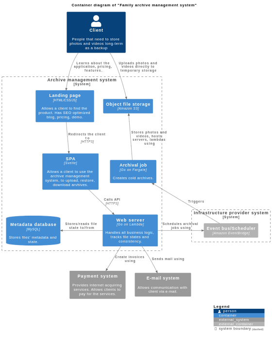

# Welcome to Family Archive documentation!

## Business POV

### Vision

To safely, reliably and cost-effectively store family photo-video archives for decades

### Mission

To develop easy-to-use software solution to help people safely archive their photos videos for decades using cloud technologies

### Values

- Reliability
- User experience & communication
- Experiments & Innovation
- Documentation
- Multiple copies

### Users

- **Customer** is a **User** that exceeds free plan of the product.
- **User** is a visitor that tries out the product.
- **Development team** is a group of people improving and supporting the product.

### User stories

#### Customer

  - As a customer I want to have pay-as-you-go pricing, because I don't want to pay for unused storage.
  - As a customer I want to have a transparent billing report, because I want to know how&why I am charged exactly that amount of money.
  - As a customer I want to have a solid account recovery process, because I want to restore my account even if I lost my email & password.

#### User

  - As a user I want to access the product in anytime, because it is comfortable to me.
  - As a user I want to have an automatic trial account to experience the product without registration.
  - As a user I want to have UX with minimal steps to complete archival, because I want to upload photos without tutorials and with minimal steps required.
  - As a user I want to be notified about the state of the uploading, because I want to understand that my photos and videos are 100% uploaded.
  - As a user I want to archive my photos and videos reliably, durably, cost-effective, securely in original form for long-term, because I want to have a 100% reliable backup.
  - As a user I want my photos and videos automatically sorted in folders, because it's hard and time consuming to sort by hand.

#### Developer

  - As a developer I want to deploy the product frequently, fast, safely, in parts to production, because I want the user have the latest updates and fix bugs fast.
  - As a developer I want to have short dev cycle and fast builds/deploys, because I want to develop and test new features quickly.
  - As a developer I want to develop cost-optimized product, because I want big money bonus :)

## Technical POV

### Technical Stakeholders

This section describes key stakeholders of the system and their needs.

- **SH-1**: **User** (availability, performance, durability, security, scalability)
  - a user wants to try out the system without a registration hassle
  - a user wants to access the system anytime
  - a user wants a system to respond fast
  - user's media files MUST NOT be lost in any case
  - user's media files MUST NOT be accessible to anyone else except the customer
- **SH-2**: **Customer** (traceability, cost-effectiveness)
  - a customer wants to see a detailed billing report
  - a customer wants to pay as little as possible
- **SH-3**: **Development team** (extensibility)
  - a developer wants a fast dev cycle and fast deployments

### Functional requirements (use cases)

- **UC-1**: **Registration**
  - a user who wants to try out the system automatically gets a temporary account (SH-1)
  - a user creates a permanent account, adds credit card (SH-1)

- **UC-2**: **Media files uploading**
  - a user uploads photo or video files (SH-1)
  - a user receives feedback on upload progress (SH-1)
  - a user reuploads files if uploading was stopped due to network errors (SH-1)

- **UC-3**: **Media files archival**
  - a user may schedule archival of files immediately (SH-1)
  
- **UC-4**: **Media file navigation**
  - a user navigates file tree (SH-1)
  - a user sees folders, archives, files inside archives (SH-1)

- **UC-5**: **Archives restoration**
  - a user restores archives (SH-1)
  - a user receives feedback on restoration progress (SH-1)
  
- **UC-6**: **Archives download**
  - a user downloads restored archives (SH-1)

- **UC-7**: **Metrics reporting**
  - a user sees his service usage metrics (SH-1)

- **UC-8**: **Billing**
  - a customer is billed automatically each month based on his service usage if exceeds a free plan (SH-2)
  - a customer sees his billing history and invoices (SH-2)

- **UC-9**: **Recovery**
  - a user can recover his account using email or phone or recovery phrases

### Non-functional requirements

- **QA-1**: **Availability** (UC-1, UC-2, UC-4, UC-5, UC-6)
  - registration, media uploading, navigation, restoration downloading must be highly available, because outages will negatively impact user experience, thus business 
  - 99.9% seems ok ([Google SRE book reference](https://sre.google/sre-book/availability-table/))
- **QA-2**: **Performance** (all UCs)
  - response time < 1s for page load 
  - the navigation must feel as smooth as file explorer on a local PC
- **QA-3**: **Durability** (UC-2, UC-3)
  - uploaded files, archives must not be lost or corrupted
- **QA-4**: **Security** (UC-1, UC-2, UC-6)
  - user's sensitive information (keys, password) must be encrypted in transit and at rest
  - user's media files must be encrypted in transit and at rest
  - customer's card information must be stored in PCI compliant third-party entity
- **QA-5**: **Scalability** (UC-1 - UC-6)
  - number of customers - thousands
  - GB of media files per customer per year - 250 GB (doubled as estimation)
  - data heavy application - consider partitioning/sharding
- **QA-6**: **Traceability** (UC-8)
  - user's actions which may incur bill number to increase must be retrievable as log
- **QA-7**: **Extensibility** (all UCs, SH-3)
  - the system must be modular, so features don't intersect with each other
- **QA-8**: **Cost-effectiveness** (all UCs)
  - the system must be the same price as Google Drive or less ([Pricing calculation document](https://docs.google.com/spreadsheets/d/1Kz_6nodd-D-6lNfJjFYPscQScEQ6BF3hPTGZQA-yn8I/edit#gid=1866810754))

## Architecture

### System context diagram

### Container diagram

The system contains of [backend](containers/backend/readme.md) and [frontend](containers/frontend/readme.md) parts.

Frontend part contains of the next containers:

- **Landing page** - [family-archive-landing](https://github.com/S1ckret-Labs/family-archive-landing)
- **SPA** - [family-archive-spa](https://github.com/S1ckret-Labs/family-archive-spa)

Backend part contains of the next containers:

- **Web server** - [family-archive-web-server](https://github.com/S1ckret-Labs/family-archive-web-server/tree/main)
- **Archival job** - [family-archive-archival-job](https://github.com/S1ckret-Labs/family-archive-archival-job)
- **Upload confirmation job** - [family-archive-upload-confirmation-job](https://github.com/S1ckret-Labs/family-archive-upload-confirmation-job)

### Process views

