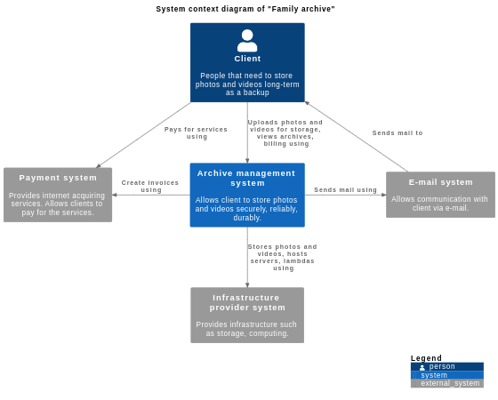
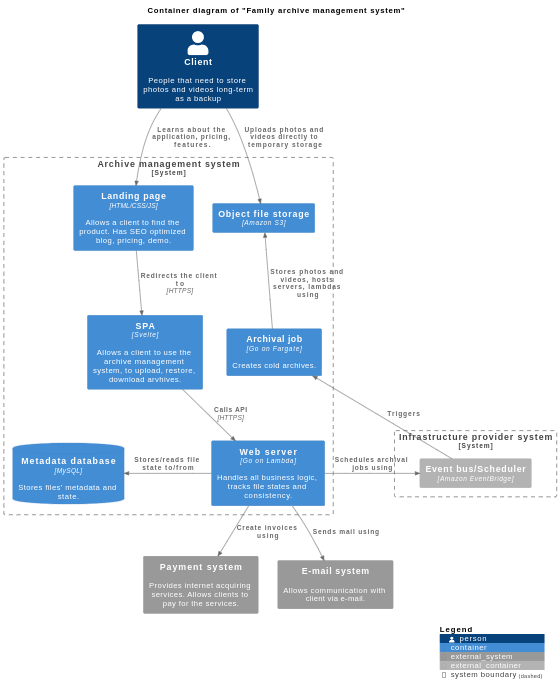

# Family Archive requirements

This document gives a brief overview of system architecture and gives links for a deep dive.

Requirements are written with [EARS](https://alistairmavin.com/ears/) templates of which you can find [here](./requirements-templates.md).

## System context diagram

## Container diagram

The system contains of [backend](containers/backend/readme.md) and [frontend](containers/frontend/readme.md) parts.

Frontend part contains of the next containers:

- **Landing page** - [family-archive-landing](containers/frontend/family-archive-landing.md)
- **SPA** - [family-archive-spa](containers/frontend/family-archive-spa.md)

Backend part contains of the next containers:

- **Web server** - [family-archive-web-server](containers/backend/family-archive-web-server.md)
- **Archival job** - [family-archive-archival-job](containers/backend/family-archive-archival-job.md)
- **Upload confirmation job** - [family-archive-upload-confirmation-job](containers/backend/family-archive-upload-confirmation-job.md)

