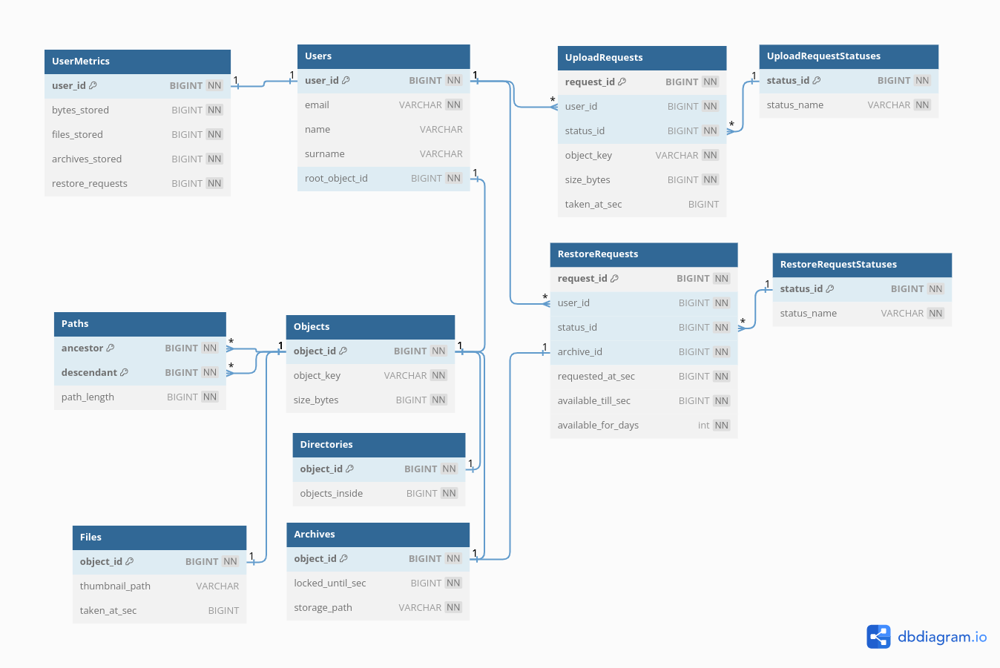

# Database design

## About

The database was designed to support dynamic user file structure, which can be altered in any way. E.g. a user can move, add, delete files, folders easily; a user can create different views for the same objects.

A lot of inspiration was taken from "SQL Antipatterns: Avoiding the Pitfalls of Database Programming" by Bill Karwin.

## Schema

The database schema can be found [here](https://dbdiagram.io/d/649e7eee02bd1c4a5e4a976c).

Some advices from the Bill's Karwin book was taken into consideration:

- (from chapter `3 Naive Trees`) I used closure table `Paths`, because I want to support arbitrary file structures in future, so I need ease of inserting, moving, copying, deleting. One thing I am worried about is huge amount of records in the table.
- (from chapter `6 Entity-Value-Attribute`) I used class table inheritance for tables `Objects`, `Files`, `Archives`, `Directories`, because they have relationship between each other, but each has different specific attributes. Also it gives strong typing and consistency.

`UploadRequests` table is used as a queue. When a user submits upload requests, the table holds objects metadata until the objects are archived.

You can find useful SQL files in this folder. 